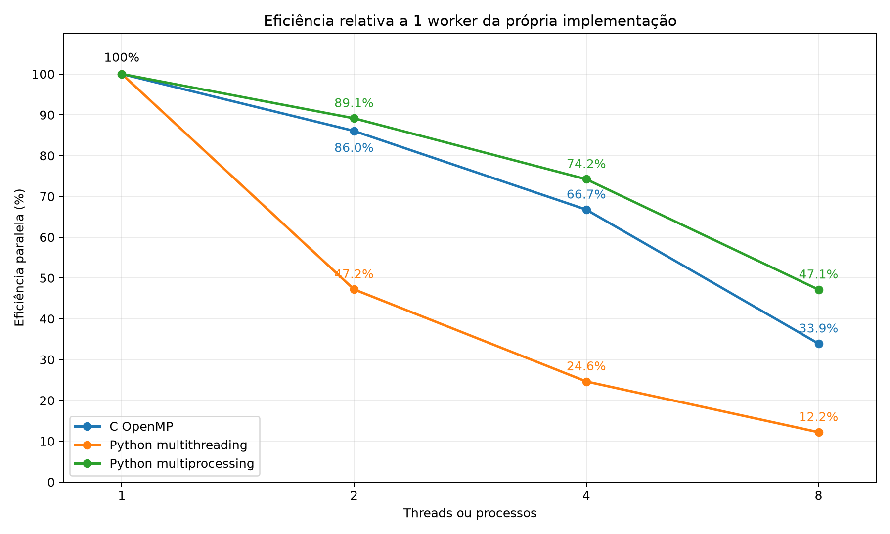
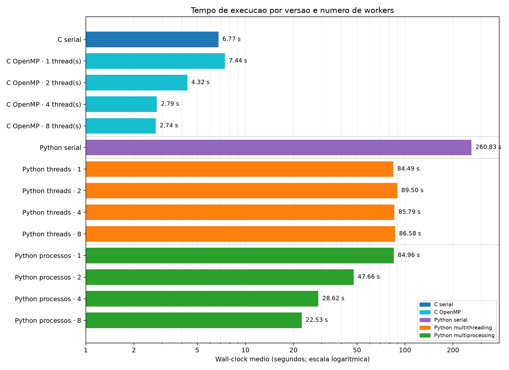
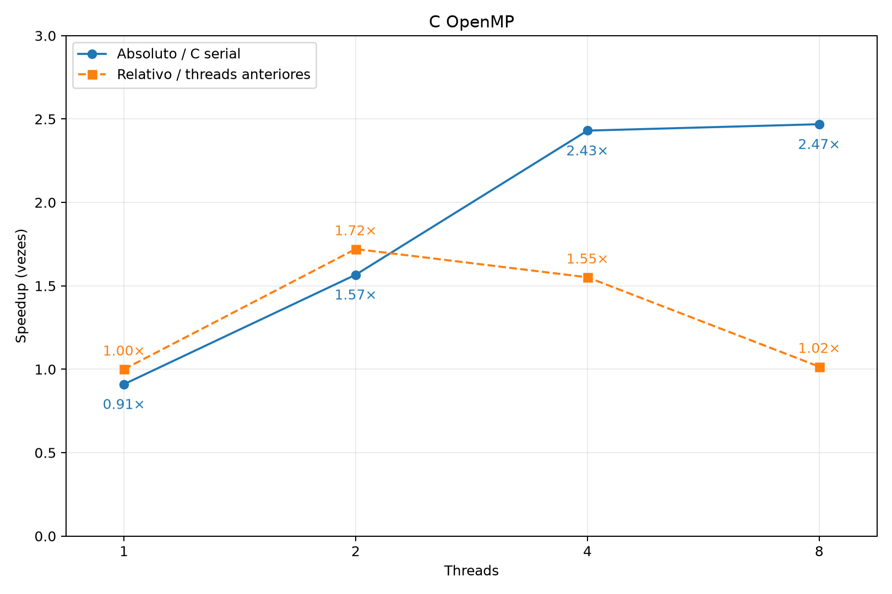
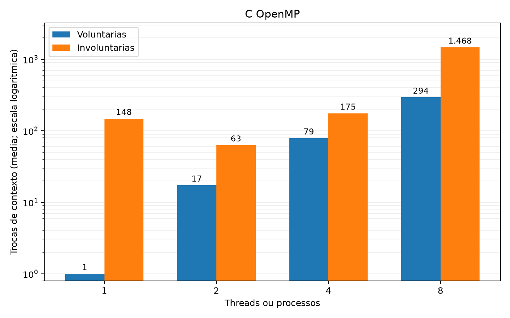
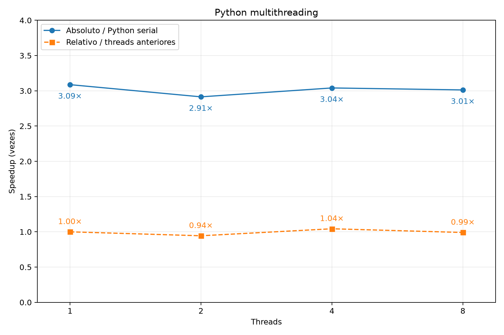
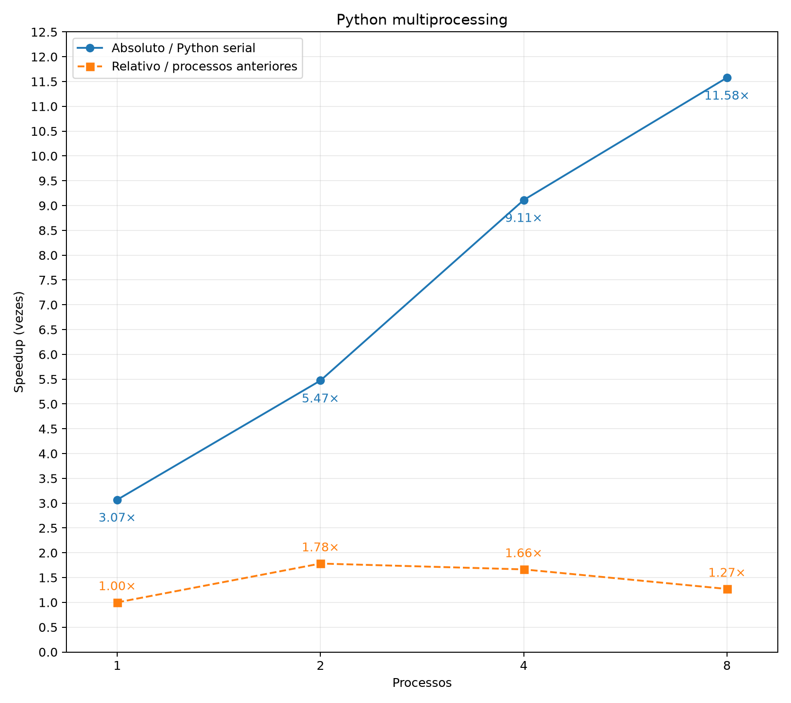
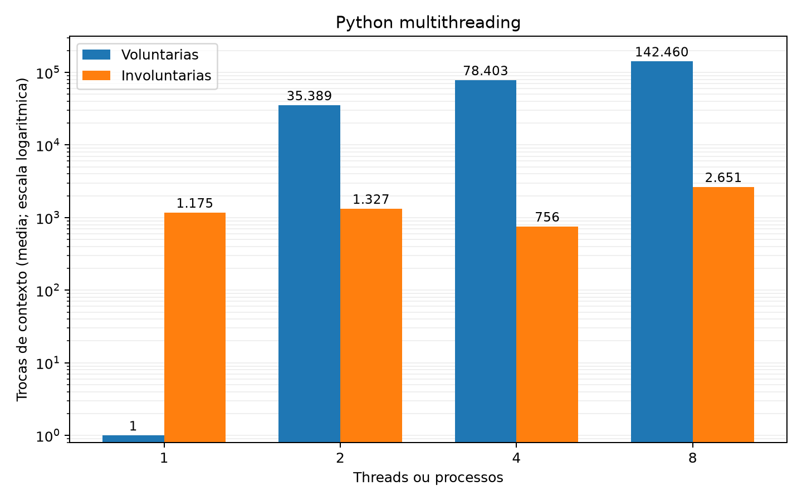
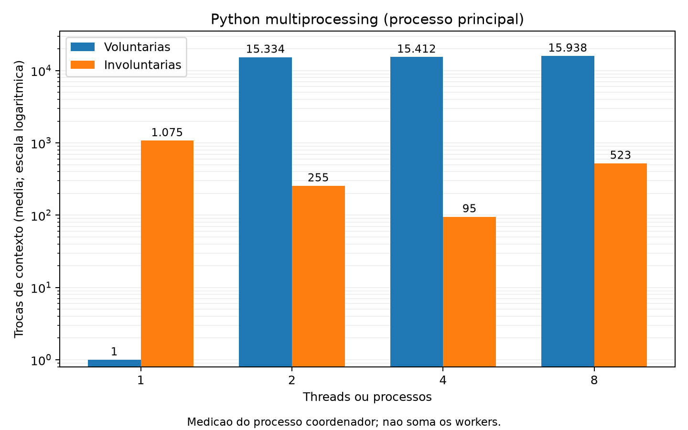
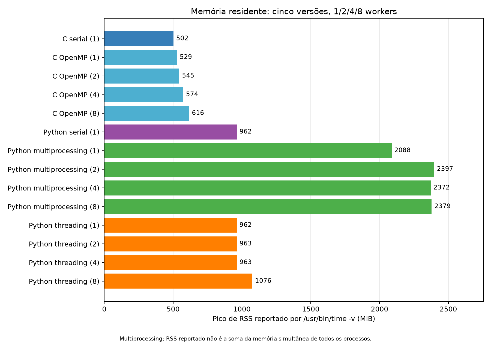

# Quantização de Cores por Octree: Comparação entre C Serial, OpenMP, Python Serial, Multithreading e Multiprocessing

**João Vítor Cedraz Carneiro**  
Engenharia de Computação  
Departamento de Tecnologia  
Universidade Estadual de Feira de Santana (UEFS)  
Feira de Santana, Bahia, Brasil  
jvcarneiro@ecomp.uefs.br

---

## Resumo

Este trabalho compara cinco implementações de quantização de cores por octree sobre uma imagem PPM P6 de 165,4 milhões de pixels, com paleta limitada a quatro cores. Foram avaliados tempo de execução, aceleração, eficiência, memória, trocas de contexto e perfis de execução. O C com OpenMP atingiu 2,47 vezes o desempenho do C serial com oito threads, mas apresentou ganho marginal de quatro para oito threads. No Python, tanto multithreading quanto multiprocessing foram mais rápidos que o serial já com um trabalhador, sobretudo porque trocaram a inserção de cada pixel por um histograma de cores distintas. Com múltiplos trabalhadores, o multithreading pouco escalou, em consonância com a contenção do GIL em código Python limitado por CPU. O multiprocessing alcançou aceleração absoluta de 11,58 com oito processos, à custa de cópias, comunicação e maior pico de memória. O estudo distingue o ganho algorítmico do ganho atribuível ao paralelismo e explicita os limites dos instrumentos de profiling utilizados.

**Palavras-chave:** octree, quantização de cores, OpenMP, GIL, multiprocessing, profiling.

> As figuras deste relatório são carregadas diretamente da pasta [`imagens/`](imagens/) e são renderizadas automaticamente pelo GitHub.

---

## 1. Introdução

A quantização de cores converte uma imagem com muitas cores em outra com uma paleta menor. O experimento usa a mesma imagem PPM P6, de `14416 × 11473` pixels (165.394.768 pixels), e fixa a paleta em quatro cores. As cinco variantes foram executadas sem difusão de erro na configuração medida. O problema é predominantemente computacional: cada pixel exige acesso à octree, e a manutenção da fila de prioridades (heap) é frequente.

O objetivo não é apenas ordenar tempos. As versões paralelas em Python também alteram a estratégia de construção da árvore. Portanto, uma comparação entre elas e o serial mistura dois efeitos: *menos trabalho algorítmico* e *execução concorrente*. Essa distinção orienta a interpretação dos dados.

---

## 2. Algoritmo e Implementações

### 2.1 Quantização por octree

Cada pixel RGB percorre sete níveis da octree; em cada nível, bits dos canais vermelho, verde e azul determinam um entre oito filhos. O nó folha acumula contagem e somas de canais. Um heap prioriza nós para redução: enquanto o número de folhas excede o limite, nós são fundidos. As cores da paleta resultam da média dos canais acumulados. Finalmente, cada pixel é substituído pela cor do nó de paleta correspondente. A leitura PPM e a escrita da saída ficam fora do núcleo de quantização, mas dentro do tempo total medido externamente.

### 2.2 C serial

A implementação em C, compilada com `-O2 -g`, processa os pixels sequencialmente. Para cada pixel, chama `node_insert` e atualiza o heap por `heap_add`. Assim, uma cor recorrente pode causar muitas atualizações da árvore e do heap. A imagem é um vetor contíguo de bytes; os nós da octree são estruturas C alocadas em blocos. Esta versão estabelece a referência da comparação em C.

### 2.3 C com OpenMP

A versão OpenMP foi compilada com `-O2 -g -fopenmp` e usa `OMP_NUM_THREADS` igual a 1, 2, 4 ou 8. Um laço distribui pixels estaticamente entre threads. Cada thread constrói uma octree e um heap locais; depois, as árvores são combinadas na árvore global dentro de uma região `critical`. A coleta das folhas e o *folding* permanecem seriais. A normalização da paleta e a substituição final de cores usam laços OpenMP. Esse desenho evita escrita concorrente na octree durante a inserção, mas cria uma etapa de merge serializada e estruturas locais adicionais.

### 2.4 Python serial

A versão serial usa apenas estruturas nativas do Python: `bytearray` para os pixels, objetos `OctreeNode`, listas para filhos e heap. Tal como o C serial, insere e atualiza o heap a cada pixel. Sua representação é mais custosa: objetos, referências e chamadas de função Python têm overhead que não existe na mesma escala na implementação em C.

### 2.5 Python multithreading

A implementação usa explicitamente `threading.Thread`. A imagem é dividida em faixas; threads constroem histogramas locais de cores e, após `join`, o processo principal combina os `Counter`. A octree e o heap são então construídos serialmente, com uma inserção por cor distinta e sua frequência acumulada. A substituição final é dividida entre threads que escrevem em faixas exclusivas do mesmo `bytearray`. O cálculo do índice dos filhos também foi incorporado à inserção por contagem. Não há cópia integral da imagem por thread. No CPython com GIL habilitado, entretanto, apenas uma thread executa bytecode Python por vez; espera-se pouca aceleração adicional em trechos limitados por CPU [1].

### 2.6 Python multiprocessing

Esta variante usa `ProcessPoolExecutor`. O processo principal copia faixas da imagem em objetos `bytes`, distribui os blocos para histogramas locais e combina os resultados. A construção da octree e do heap continua serial, novamente com uma inserção por cor distinta. Outro pool substitui as cores dos blocos; os resultados são reunidos no processo principal. A comunicação requer serialização e cópias de dados. Cada processo possui seu próprio interpretador e GIL, podendo executar bytecode simultaneamente com outros processos [2]. Com um trabalhador, o código tem um caminho direto e **não cria** um processo filho nas duas fases paralelizáveis.

---

## 3. Metodologia e Métricas

O tempo de processo completo foi medido com:

```bash
/usr/bin/time -v
```

C serial, C OpenMP e as versões Python com workers tiveram três repetições por configuração; Python serial teve uma. Os tempos da Tabela 1 são médias de wall-clock; RSS é o maior pico observado nas repetições. As medições de profiling são execuções separadas e não devem ser comparadas diretamente com os tempos sem instrumentação. A imagem é a mesma e o parâmetro de saída é quatro cores. Os dados provêm de `run-Zz7rg9Ye`.

Definimos o speedup absoluto por linguagem e o speedup relativo ao ponto anterior, respectivamente, por:

$$
S_{\mathrm{abs}}(n)=\frac{T_{\mathrm{serial}}}{T(n)}
$$

e, para $n>1$,

$$
S_{\mathrm{rel}}(n)=\frac{T(n/2)}{T(n)}.
$$

Para $n=1$, o relativo é definido como 1, pois não existe uma configuração anterior com menos workers; a comparação com o serial está em $S_{\mathrm{abs}}$.

A eficiência nominal é:

$$
E(n)=\frac{S_{\mathrm{abs}}(n)}{n}.
$$

Quando algoritmos diferem, essa eficiência **não** isola a eficiência do paralelismo: pode exceder 100% em um worker devido à mudança algorítmica. Para estudar apenas o aumento de workers, é mais apropriado comparar:

$$
\frac{T(1)}{T(n)}.
$$

### Eficiência relativa ao worker único



### Tabela 1 — Tempo, speedup absoluto e relativo, eficiência e RSS

Wall em segundos; RSS em MiB.

| Versão | Workers | Wall | $S_{\mathrm{abs}}$ | $S_{\mathrm{rel}}$ | $E$ | RSS máx. |
|---|---:|---:|---:|---:|---:|---:|
| C serial | 1 | 6,77 | 1,00 | — | — | 502 |
| C OpenMP | 1 | 7,44 | 0,91 | 1,00 | 0,91 | 529 |
| C OpenMP | 2 | 4,32 | 1,57 | 1,72 | 0,78 | 545 |
| C OpenMP | 4 | 2,79 | 2,43 | 1,55 | 0,61 | 574 |
| C OpenMP | 8 | 2,74 | 2,47 | 1,02 | 0,31 | 616 |
| Python serial | 1 | 260,83 | 1,00 | — | — | 962 |
| Python threading | 1 | 84,49 | 3,09 | 1,00 | 3,09 | 962 |
| Python threading | 2 | 89,50 | 2,91 | 0,94 | 1,46 | 963 |
| Python threading | 4 | 85,79 | 3,04 | 1,04 | 0,76 | 963 |
| Python threading | 8 | 86,58 | 3,01 | 0,99 | 0,38 | 1076 |
| Python multiprocessing | 1 | 84,96 | 3,07 | 1,00 | 3,07 | 2088 |
| Python multiprocessing | 2 | 47,66 | 5,47 | 1,78 | 2,74 | 2397 |
| Python multiprocessing | 4 | 28,62 | 9,11 | 1,67 | 2,28 | 2372 |
| Python multiprocessing | 8 | 22,53 | 11,58 | 1,27 | 1,45 | 2379 |

### Comparação de tempo de execução



---

## 4. Resultados de Escalabilidade

### 4.1 OpenMP

O OpenMP com uma thread foi 9% mais lento que o C serial. Uma thread não elimina a criação de árvore e heap locais, o merge, a coleta de folhas nem o runtime OpenMP; logo, as duas versões não percorrem um caminho idêntico. De 1 para 2 e de 2 para 4 threads, os ganhos relativos foram 1,72 e 1,55. De 4 para 8, somente 1,02: o tempo caiu de 2,79 para 2,74 s, diferença pequena diante da variação entre repetições. O ganho absoluto em oito threads foi 2,47, e a eficiência nominal caiu para 0,31.



Na mesma passagem de quatro para oito threads, as trocas voluntárias de contexto subiram de 79 para 294 e as involuntárias de 175 para 1468. Esperas em barreiras e na região `critical` podem aumentar as trocas voluntárias; competição por CPU pode elevar as preempções involuntárias. Cada interrupção exige escalonamento e pode reduzir a reutilização de dados em cache quando a thread retoma. Isso ajuda a entender por que mais trabalho de CPU não se converteu em menor wall-clock, embora as contagens não provem que as trocas sejam o fator dominante frente ao merge e aos acessos à memória.



### 4.2 Python: separar algoritmo de paralelismo

As versões com um worker já levam aproximadamente 85 s, ante 260,83 s no Python serial. Isso não representa aceleração paralela: com um único worker não há concorrência útil e, em multiprocessing, nem é criado processo filho. O motivo principal é a construção prévia do histograma. Em vez de chamar `node_insert` e `heap.add` por pixel, as variantes paralelas fazem essas operações por cor distinta, com a frequência acumulada. Também evitam chamar `_child_index` a cada nível da inserção. Portanto,

$$
S_{\mathrm{abs}}(1)\approx3,1
$$

mede sobretudo uma otimização algorítmica.

Os perfis das versões com histograma registram 988.676 chamadas a `_node_insert_count`, contra 165.394.768 chamadas a `node_insert` no serial: aproximadamente 167 vezes menos inserções.

Ao aumentar apenas o número de threads, o wall-clock fica entre 84,49 e 89,50 s. O ganho relativo não é consistente e a CPU do processo permanece próxima de 100%, compatível com execução de bytecode essencialmente serializada pelo GIL.

 Já multiprocessing cai de 84,96 para 22,53 s com oito processos, ou:

$$
\frac{84,96}{22,53}=3,77
$$

vezes em relação ao seu próprio worker único.

O speedup absoluto de 11,58 em relação ao Python serial combina esses dois efeitos e, por isso, não deve ser descrito como aceleração paralela pura.

 O padrão de trocas de contexto reforça essa leitura: no threading, as voluntárias passam de cerca de uma com um worker para 78,4 mil com quatro e 142,5 mil com oito. A alternância entre threads que disputam o GIL e aguardam sincronização consome tempo sem executar mais bytecode em paralelo. No multiprocessing, o coordenador registra cerca de 15 mil trocas voluntárias com múltiplos processos, coerentes com espera por resultados; apesar desse custo, o wall-clock diminui porque os workers executam simultaneamente.

#### Trocas de contexto no Python multithreading



#### Trocas de contexto no Python multiprocessing



---

## 5. Análise de Profiling

### 5.1 C serial: gprof, Callgrind, Cachegrind e strace

O `gprof` atribuiu 42,95% do tempo próprio a `node_insert`, 29,91% a `up_heap` e 10,26% a `down_heap`. Houve 165,4 milhões de chamadas a `node_insert` e 165,6 milhões a `heap_add`. Assim, os hotspots são inserção e manutenção do heap, não leitura do arquivo.

O `Callgrind` contabilizou 58,08 bilhões de referências a instruções; `node_insert` respondeu por aproximadamente 53% delas. O perfil do `Cachegrind` disponível foi anotado apenas para referências a instruções (`Ir`); ele não sustenta uma conclusão quantitativa sobre misses de dados do C serial. No `strace -c`, foram 0,161 s somados em syscalls, sobretudo `read` (0,147 s). Isso é pequeno diante dos 6,77 s sem profiling e corrobora a classificação CPU-bound.

### 5.2 C OpenMP: hotspots e limite de oito threads

Os perfis `gprof` de 1, 2, 4 e 8 threads mantêm `node_insert`, `up_heap`, `down_heap` e `color_replace` no topo. O percentual de self time de `node_insert` foi 45,37%, 45,83%, 50,67% e 54,36%, respectivamente. Esses percentuais são indícios da persistência do hotspot, não uma medição exata de tempo por thread: o `gprof` convencional não é um profiler confiável de toda a execução OpenMP, e suas contagens de chamadas parciais não devem ser somadas ou comparadas como se fossem globais.

O `perf stat` mostrou, de 4 para 8 threads, task-clock de 10,86 para 17,29 s, cache misses `cpu_core` de 558 milhões para 1,04 bilhão e mais context switches na execução perfilada, de 392 para 854. Esses contadores são agregados por tarefa e tiveram frações distintas de tempo habilitado, 86,5% e 53,9%; portanto, não permitem atribuir causalidade isolada ao cache. Na medição externa, o tempo de usuário aumentou de 10,06 para 18,20 s, enquanto o wall-clock quase não mudou. O trabalho total de CPU aumentou sem ganho proporcional de tempo decorrido.

O `Callgrind` da versão OpenMP registrou aproximadamente 57,64 e 58,06 bilhões de referências a instruções em 4 e 8 threads; os misses de leitura L1 de dados passaram de 673 para 695 milhões. Em `merge_tree`, os misses de leitura de último nível cresceram de aproximadamente 9,48 para 15,80 milhões no modelo simulado. Isso é coerente com uma combinação mais custosa das árvores locais quando há mais threads. Como o Valgrind simula a hierarquia de cache e altera fortemente a execução, esses números apoiam uma hipótese, não uma estimativa direta do tempo perdido.

### 5.3 Python serial, threading e multiprocessing

No `cProfile` do Python serial, a quantização instrumentada levou 650,54 s, não os 260,83 s da execução normal. Houve 3,08 bilhões de chamadas de função; `node_insert` teve 295,81 s acumulados, `heap.add` 212,36 s, `_up` 110,45 s e `_replace_colors` 95,36 s. `_child_index` sozinho teve 1,52 bilhão de chamadas. Os tempos *acumulados* de funções aninhadas não podem ser somados. O perfil mostra que o custo da octree é ampliado pela quantidade de pequenas operações e chamadas interpretadas. O `strace -c` do serial registrou apenas 0,159 s em syscalls na execução perfilada; I/O não explica o tempo total.

No `cProfile` do threading com quatro threads, a execução instrumentada durou 152,67 s. Aparecem `threading.join` e espera em locks; o tempo acumulado de `join` pode incluir esperas sobrepostas e não corresponde a tempo de CPU gasto dentro de `join`. O histogramador e a substituição de pixels continuam em código Python. As trocas voluntárias de contexto sobem de aproximadamente 1 na configuração com uma thread para 78,4 mil com quatro, compatíveis com espera e alternância, inclusive pelo GIL.

No `cProfile` válido do multiprocessing com quatro processos, obtido na execução de recuperação, o programa instrumentado durou 33,11 s. No processo principal, `_build_histogram_multiprocessing` acumulou 14,02 s, `_replace_colors_multiprocessing` 10,98 s e houve espera no executor, filas e `poll`. O processo principal também executa `pickle.loads` e combina resultados. Seu `cProfile` não revela o custo interno completo dos processos filhos; `poll` alto indica espera por resultados, não prova que a comunicação seja o gargalo principal. O perfil anterior de 0,719 s terminou com falha e foi excluído desta análise.

---

## 6. Comparações e Hipóteses

### 6.1 Uso de CPU, contexto e memória

A Tabela 2 mostra que o C OpenMP chega a 673% de CPU em oito threads, enquanto threading Python fica perto de 102%. Este último resultado é consistente com o GIL na carga CPU-bound. Para multiprocessing, o percentual de CPU e as trocas de contexto do `/usr/bin/time -v` **não representam a soma de todos os processos filhos**; por isso não podem ser lidos como utilização global de 33% com oito processos. O `perf stat` da execução de quatro processos, por exemplo, acumulou 94,85 s de task-clock em 28,41 s de tempo decorrido, evidenciando execução de CPU em paralelo.

### Tabela 2 — Recursos selecionados da medição externa

| Versão | User (s) | CPU (%) | Contexto V/I |
|---|---:|---:|---:|
| C serial | 6,61 | 99 | 1/60 |
| C OpenMP 4 | 10,06 | 367 | 79/175 |
| C OpenMP 8 | 18,20 | 673 | 294/1468 |
| Python serial | 260,29 | 99 | 1/4796 |
| Python threads 4 | 86,12 | 101 | 78403/756 |
| Python processos 4 | 4,62 | 22 | 15412/95 |

Na tabela, V indica uma troca voluntária, quando a tarefa cede a CPU para aguardar um recurso; I indica uma interrupção involuntária pelo escalonador. O Python serial registra mais trocas involuntárias que o C serial em número absoluto, mas também executa por aproximadamente 39 vezes mais tempo. No multiprocessing, as contagens externas não somam as preempções dos filhos. Portanto, comparar apenas números brutos, sem considerar duração e escopo da medição, não identifica uma causa de lentidão.

O C serial atingiu pico de 502 MiB; o C OpenMP passou de 529 para 616 MiB entre uma e oito threads, pois árvores e heaps locais coexistem com a árvore global. O Python serial atingiu 962 MiB; seus nós, listas e inteiros são objetos com overhead superior ao de estruturas C. O threading compartilha a imagem e manteve pico próximo de 962 MiB até quatro threads, chegando a 1076 MiB em oito. O multiprocessing já reporta 2088 MiB com um worker, **sem criar filho**: `_pixel_chunks` copia a imagem, e a etapa de substituição cria buffers temporários de entrada e saída. Com mais processos, serialização, resultados e estruturas independentes elevam o custo. O RSS reportado para multiprocessing não é a soma da memória simultânea de todos os filhos, de modo que o consumo total pode ser maior.



### 6.2 Fenômenos observados

O ganho quase nulo do OpenMP de quatro para oito threads é compatível com três fatores combinados:

1. parte serial do *folding* e do merge protegido por `critical`;
2. mais trabalho agregado de CPU e trocas de contexto;
3. pressão maior sobre caches durante o processamento de árvores locais.

A evidência disponível não permite quantificar a contribuição individual de cada fator.

Pela lei de Amdahl,

$$
S(n)\leq\frac{1}{(1-p)+p/n},
$$

mas, sem medir a fração paralelizável $p$, não há limite teórico numérico defensável para este caso.

O Python multithreading não reduz substancialmente o tempo ao adicionar threads porque o histograma, a busca na octree e a substituição de cores executam bytecode Python. O ganho frente ao serial surge antes, pela redução de operações na octree via histograma. Multiprocessing contorna a restrição de um GIL compartilhado, mas não elimina as fases seriais nem os custos de criação, cópia e comunicação; por isso seu ganho relativo também cai ao passar de quatro para oito processos, chegando a 1,27.

O C serial foi aproximadamente:

$$
\frac{260,83}{6,77}=38,5
$$

vezes mais rápido que o Python serial. O `perf stat` registrou cerca de 4,07 trilhões de instruções `cpu_core` no Python serial, contra 59,0 bilhões no C serial, em execuções separadas; isso é compatível com o custo de interpretação e manipulação de objetos. Os eventos de `perf` em arquitetura híbrida e sob multiplexação não são perfeitamente comparáveis entre todos os runs; esses números são evidência de ordem de grandeza, não decomposição causal precisa do tempo.

---

## 7. Limitações

O benchmark mede uma imagem e uma paleta de quatro cores; outras imagens, distribuições de cores e CPUs podem alterar o resultado. Os tempos de profiling sofrem perturbação da instrumentação. O `cProfile` do processo principal não inclui automaticamente o trabalho detalhado de cada filho. O `gprof` não fornece uma visão completa e confiável das threads OpenMP. Cachegrind e Callgrind modelam eventos e não equivalem diretamente a contadores físicos.

Os cinco programas seguem a mesma finalidade, mas as variantes Python paralelas empregam histograma e, por isso, não constituem um experimento de paralelização *sem mudança algorítmica*. Não se afirma identidade pixel a pixel das imagens de saída sem uma verificação formal adicional.

Além disso, o C serial medido durou 6,77 s, abaixo do mínimo de 20 s previsto no enunciado original; os resultados permanecem válidos como observação experimental, mas essa exigência não foi satisfeita.

---

## 8. Conclusão

A quantização por octree é dominada por inserção na árvore, manutenção do heap e substituição de pixels, não por I/O. O ganho inicial das variantes Python com um worker resulta principalmente do histograma, que diminui operações repetidas sobre cores iguais. Com múltiplos workers, threading permanece limitado pelo GIL, enquanto multiprocessing oferece paralelismo real, mas consome mais memória e introduz comunicação. O C OpenMP combina baixo custo por operação e execução paralela; contudo, de quatro para oito threads, sincronização, trabalho serial e custos de memória tornam o ganho marginal. A principal conclusão metodológica é que speedup entre versões diferentes deve ser decomposto em ganho algorítmico e ganho paralelo antes de ser interpretado como eficiência de escalabilidade.

---

## Referências

[1] Python Software Foundation. **threading — Thread-based parallelism**. Documentação oficial do Python.  
<https://docs.python.org/3/library/threading.html>

[2] Python Software Foundation. **concurrent.futures — ProcessPoolExecutor**. Documentação oficial do Python.  
<https://docs.python.org/3/library/concurrent.futures.html>

[3] OpenMP Architecture Review Board. **OpenMP API Specification 5.2 — critical Construct**.  
<https://www.openmp.org/spec-html/5.2/openmpse90.html>

[4] Repositório local do experimento.  
`resultados/resumos/run-Zz7rg9Ye/wall_summary.csv`, `metrics.csv` e perfis em `resultados/C_results` e `resultados/python_results`, 2026.

---
